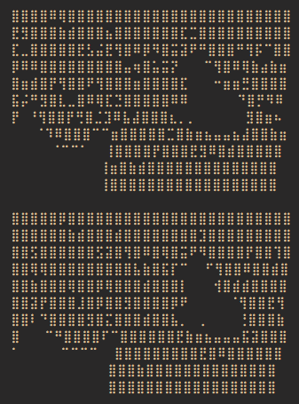

# Video to text converter

This script allows you to convert video files to unicode braille characters.

## 🤔 How to use it

If you don't want to mess up with the code, just put a video file named `video.mp4` in the same directory as the `main.py` file and run the script. But keep that in mind: generated frames will have a 4:3 ratio (_48 by 60 pixels_).\
If changing some code is not a problem for you, then just go and play with arguments passed to `generate_frames` function.

### 🐢 Example

## 💡 How it works

Every video is made of multiple frames. This script takes each of them and converts it into a black and white image. Generated picture is then divided into rectangles of size of 2 by 4 pixels and transformed into braille characters.

**Side note**: You can read more about how unicode handles the braille characters [here](https://en.wikipedia.org/wiki/Braille_Patterns). But basically, they represent a binary number using filled and empty dots.
